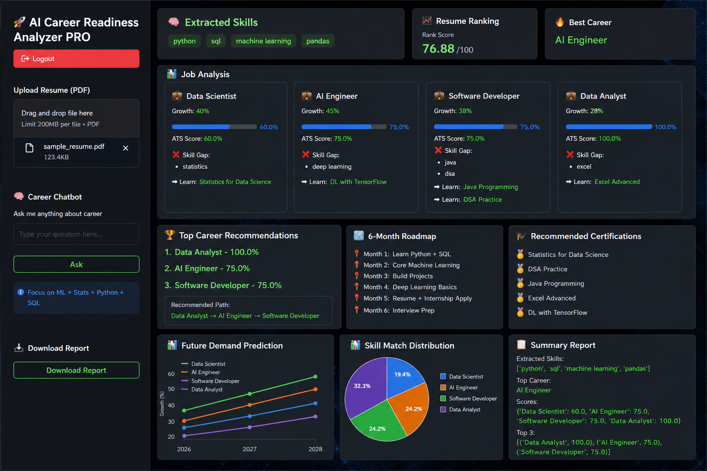

# 🚀 AI Career Readiness Analyzer PRO

## 📌 Description

AI Career Readiness Analyzer PRO is an intelligent web application that analyzes a user's resume (PDF) and provides insights into career readiness. It evaluates skills, calculates ATS scores, identifies skill gaps, and recommends suitable career paths along with a structured roadmap.

This project helps students and job seekers understand their strengths, weaknesses, and how to improve for better career opportunities.

---

## ✨ Features

* 🔐 Secure Login System
* 📄 Resume Upload (PDF)
* 🧠 Automatic Skill Extraction
* 📊 ATS Score Calculation
* 💼 Job Role Matching
* ❌ Skill Gap Analysis
* 🎓 Course Recommendations
* 🏆 Top Career Suggestions
* 🗺 6-Month Career Roadmap
* 📈 Resume Ranking Score
* 📊 Graphical Visualization (Line Chart & Pie Chart)
* 💬 Career Chatbot
* 📥 Downloadable Report

---

## 🛠️ Tech Stack

* **Programming Language:** Python
* **Framework:** Streamlit
* **Libraries:**

  * pdfplumber
  * NumPy
  * Matplotlib

---

## 📂 Project Structure

```
career-readiness-analyzer/
│── app.py
│── README.md
│── requirements.txt
│── output.png
```

---

## ⚙️ Installation

1. Clone the repository:

```
git clone https://github.com/amrutha3542/career-readiness-analyzer.git
```

2. Navigate to the project folder:

```
cd career-readiness-analyzer
```

3. Install dependencies:

```
pip install -r requirements.txt
```

---

## ▶️ How to Run

```
streamlit run app.py
```

---

## 🔑 Login Credentials

```
Username: admin
Password: 1234
```

---

## 📊 How It Works

1. User logs into the application
2. Uploads resume in PDF format
3. System extracts skills using keyword matching
4. Calculates ATS score for different job roles
5. Identifies missing skills (skill gaps)
6. Suggests courses to improve skills
7. Recommends best career paths
8. Displays insights using graphs and charts

---

## 📸 Output



---

## 🚀 Future Enhancements

* 🤖 AI-based resume parsing using NLP
* 🌐 Real-time job market integration
* 📚 Course recommendations with direct links
* 💬 Advanced AI chatbot
* ☁️ Cloud deployment (Streamlit Cloud / AWS)

---

## 🎯 Use Cases

* Students preparing for placements
* Job seekers improving resumes
* Career guidance systems
* Academic final year projects

---

## 👩‍💻 Author

**Amrutha**

---

## ⭐ Acknowledgements

This project is developed as part of a B.Tech final year project to demonstrate AI-based career analysis and recommendation system using Streamlit.

---
